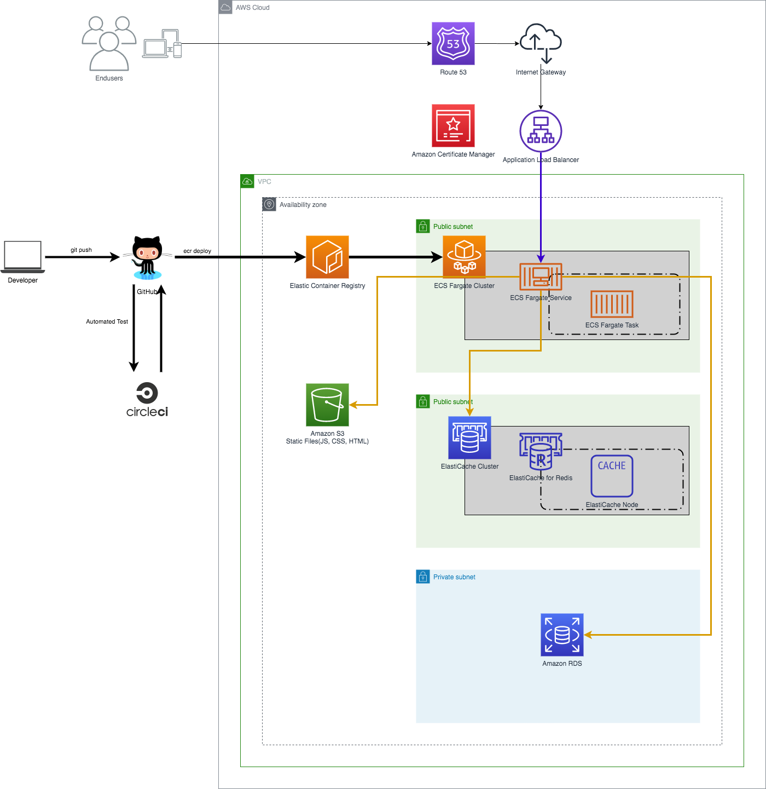

The Repository about Riflessione Service

=================================

Describe the procedure for building the Development Environment and various procedures required for Development.

## AWS Architecture



## Build the Development Environment

- Assuming development with Mac OS X
- Install Docker for Mac
- Clone this repository

```bach
git clone git@github.com:daisakuhazui/riflessione-django.git
cd riflessione-django
```

## About .env file

Copy `env.sample` file, and then rename it `.env`.
Enter the required information such as AWS Access Key in `.env`.

```bash
cp env.sample .env
```

## Build the Docker Container
```bash
make build
```

```bash
make migrate
```

## Various Procedures

### Build the Docker Container

```bash
make build
```

### Start the Docker Container

```bash
make up
```

### Run Test

```bash
make test
```

### Work inside the Docker app Container

```bash
make run
```

### Stop the Docker Container

```bash
make stop
```

### Execute Django Migration

```bash
make migrate
```
